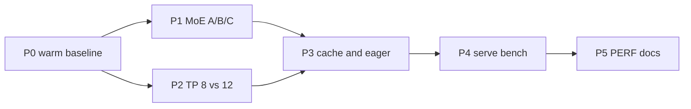

# Plan: gpt-oss-120b performance on Aurora XPU

**Prerequisite:** Phases 0–6 CLOSED (`SUCCESS_INFER.md`, `SUCCESS_TRAIN.md`).  
**Workdir:** `workdir/llm/gpt-oss-120b`  
**Problem:** Phase 5 PASS used TP=8, bf16 + MXFP4 weights, but reported ~343 s TTFT / ~0.37 e2e tok/s — unacceptable as a production metric (cold JIT + REF MoE dominated).

This plan does **not** reopen stack bring-up. Goal is **measured** warm throughput and latency with **quality preserved**.

---

## Context (what we already know)

| Item | Phase 5 PASS value |
|------|-------------------|
| Tiles used | **8 / 12** (`tensor_parallel_size=8`) |
| Node tiles | 12 (`xpu_count=12`) |
| Compute dtype | **bfloat16** |
| Checkpoint MoE | **MXFP4** (`gpt_oss_mxfp4`) |
| MoE path | **REF** (`VLLM_XPU_FUSED_MOE_USE_REF=1`) — required for non-`!!!` text |
| Attention | `TRITON_ATTN` |
| Eager | `enforce_eager=True` |
| Selector | `level_zero:gpu` + Triton `driver.c` patch + `TRITON_INTEL_DEVICE_EXTENSIONS` |

**PVC / Data Center GPU Max 1550 precision reality:**

| Format | Hardware (XMX/DPAS) | Software / this stack |
|--------|---------------------|------------------------|
| BF16 / FP16 / INT8 | Native XMX | Primary fast path |
| FP8 (E4M3/E5M2) | Not first-class native XMX like BF16; often **upcast toward FP16/BF16** before DPAS (see Triton/IGC PVC FP8 work) | vLLM XPU reports `supports_fp8()=True`; kernels may use FP8 storage + convert |
| MXFP4 / FP4 | **No native FP4 tensor cores** on PVC (unlike NVIDIA Blackwell) | Weights stored MXFP4; compute typically dequant → BF16/FP16 (or experimental `mxfp4_fp8` recipe in `vllm_xpu_kernels`) |

So: we can *run* FP8/MXFP4 **formats**, but on PVC we should not expect Blackwell-class native FP4/FP8 matmul. Perf wins will come from **fused kernels, warm cache, tile utilization, less REF**, not from “flip to FP4 tensor cores.”

---

## Success criteria

| Metric | Definition | Gate |
|--------|------------|------|
| Warm TTFT | First token after warmup + hot Triton/SYCL caches | Document; target ≪ cold 343 s (order-of-magnitude drop) |
| Warm decode tok/s | Tokens after first, exclude JIT | Primary KPI; report for max_tokens≥128 |
| Quality | Same MOF prompt; non-garbage, coherent | Must match Phase 5 spirit (no all-`!`) |
| Utilization | TP tiles used | Prefer TP=12 if memory allows and tok/s rises |

Deliverable: `build-vllm-xpu/PERF.md` + `SUCCESS_PERF.md` with `PERF_JSON={...}`.

---

## Workstreams

### P0 — Honest baseline (do first)

1. Keep PASS recipe (REF MoE + TRITON_ATTN + L0).
2. Persist caches across generates in one job:
   - Fixed `TRITON_CACHE_DIR` / `SYCL_CACHE_DIR` on node-local `/tmp` or scratch for the job lifetime.
3. `one_chat.py`: print metrics for **warmup** and **timed** separately; add a third generate as `warm2`.
4. Log `PERF_JSON` with `cold_ttft_s`, `warm_ttft_s`, `warm_e2e_tok_s`, `n_tiles`, `moe_mode`, `attn`.

**Do not** optimize until P0 numbers exist.

### P1 — MoE path (largest likely algorithmic win)

REF MoE was required for quality vs fused MXFP4 → all-`!`. Revisit carefully:

| Experiment | Env / flag | Expect |
|------------|------------|--------|
| A | `VLLM_XPU_FUSED_MOE_USE_REF=1` (baseline) | Correct, slow |
| B | unset REF; fused `mxfp4` | Fast?; quality? |
| C | `VLLM_XPU_FUSED_MOE_USE_MXFP4_FP8=1` (no REF) | Act in FP8 recipe; quality? |
| D | REF only for failing layers if such control exists | Hybrid |

**Rule:** any faster path that reintroduces token-id-0 / `!!!` is FAIL for that experiment.

### P2 — Tile scaling

- TP=8 (current) vs **TP=12** (full Aurora node under FLAT hierarchy).
- Watch KV memory (`gpu_memory_utilization`), CCL (`CCL_WORKER_COUNT=1` still).
- Optional later: 2-node TP/PP only after single-node saturates.

### P3 — Compile / graphs / warmup

- Pre-warm Triton attention shapes (dummy generate covering prefill+decode lengths).
- Revisit `enforce_eager=False` only after warm baseline; torch.compile/inductor previously hurt XPU — gate carefully (`TORCHDYNAMO_DISABLE` may stay).
- Avoid OpenCL in `ONEAPI_DEVICE_SELECTOR` (SEGV). Keep L0 + extensions + patched `driver.c`.

### P4 — Serving realism

- Bring up `infer_serve.pbs` / OpenAI API.
- Benchmark concurrent clients (1, 4, 8) for **aggregate** tok/s.
- Continuous batching may amortize MoE better than single-stream smoke.

### P5 — Writeup

- `PERF.md`: experiments table, PVC FP8/FP4 notes, final recipe.
- `SUCCESS_PERF.md`: best `PERF_JSON` + quality excerpt.
- Update root `README.md` “performance” section (link only; don’t rewrite Phase 5 PASS).

---

## Suggested job script skeleton

`bench_perf.pbs` + `bench_perf.py`:

- Same env as `infer_chat.pbs`.
- Args: `--tp {8,12}` `--moe {ref,fused,mxfp4_fp8}` `--runs 3`.
- Always run smoke + quality check before accepting metrics.

PBS: still `-q debug`, `walltime=00:59:59`, `-A MatSciAI` unless user approves longer/prod queue for sustained bench.

---

## Explicit non-goals (this plan)

- Rebuilding torch/IPEX/vLLM from scratch.
- Claiming native FP4 tensor-core parity with Blackwell.
- Accepting garbage text for higher tok/s.
- Substituting a tiny non–gpt-oss model for “fake” speed wins.

---

## Ordering

Start at **P0** only.
