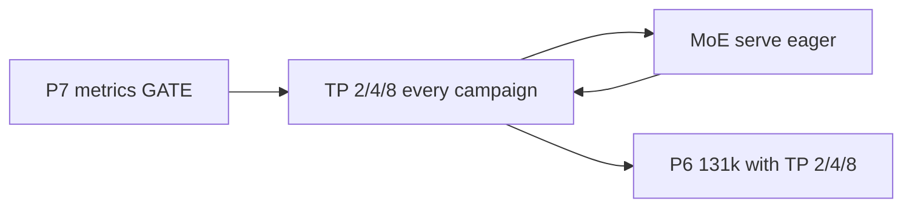

# Plan: gpt-oss-120b performance on Aurora XPU

**Prerequisite:** Phases 0–6 CLOSED (`SUCCESS_INFER.md`, `SUCCESS_TRAIN.md`).  
**Workdir:** `workdir/llm/gpt-oss-120b`  
**Problem:** Phase 5 PASS used TP=8, bf16 + MXFP4 weights, but reported ~343 s TTFT / ~0.37 e2e tok/s — unacceptable as a production metric (cold JIT + REF MoE dominated).

This plan does **not** reopen stack bring-up. Goal is **measured** warm throughput and latency with **quality preserved**.

---

## Context (what we already know)

| Item | Phase 5 PASS value |
|------|-------------------|
| Tiles used | **8 / 12** (`tensor_parallel_size=8`) |
| Node tiles | 12 (`xpu_count=12`) |
| Compute dtype | **bfloat16** |
| Checkpoint MoE | **MXFP4** (`gpt_oss_mxfp4`) |
| MoE path | **REF** (`VLLM_XPU_FUSED_MOE_USE_REF=1`) — required for non-`!!!` text |
| Attention | `TRITON_ATTN` |
| Eager | `enforce_eager=True` |
| Selector | `level_zero:gpu` + Triton `driver.c` patch + `TRITON_INTEL_DEVICE_EXTENSIONS` |

**PVC / Data Center GPU Max 1550 precision reality:**

| Format | Hardware (XMX/DPAS) | Software / this stack |
|--------|---------------------|------------------------|
| BF16 / FP16 / INT8 | Native XMX | Primary fast path |
| FP8 (E4M3/E5M2) | Not first-class native XMX like BF16; often **upcast toward FP16/BF16** before DPAS (see Triton/IGC PVC FP8 work) | vLLM XPU reports `supports_fp8()=True`; kernels may use FP8 storage + convert |
| MXFP4 / FP4 | **No native FP4 tensor cores** on PVC (unlike NVIDIA Blackwell) | Weights stored MXFP4; compute typically dequant → BF16/FP16 (or experimental `mxfp4_fp8` recipe in `vllm_xpu_kernels`) |

So: we can *run* FP8/MXFP4 **formats**, but on PVC we should not expect Blackwell-class native FP4/FP8 matmul. Perf wins will come from **fused kernels, warm cache, tile utilization, less REF**, not from “flip to FP4 tensor cores.”

**Metric gap (2026-07-20):** Baseline warm2 e2e ≈ **0.372 tok/s** with `quality_ok`. Engine `first_token_latency` is missing → `ttft_s=null`, `ttft_source=fallback_wall`. Prefill/decode TPS not separable. S1 correctly stopped calling e2e wall “TTFT.”

---

## Success criteria

| Metric | Definition | Gate |
|--------|------------|------|
| Warm TTFT | First token after warmup + hot Triton/SYCL caches (`ttft_source` ≠ `fallback_wall`) | Document; target ≪ cold e2e wall |
| Warm prefill tok/s | `n_prompt / ttft_s` (BS=1) | Report alongside TTFT |
| Warm decode tok/s | Tokens after first, exclude JIT | Primary KPI; report for max_tokens≥128 |
| Warm e2e tok/s | `n_out / wall_s` | Keep as sanity check |
| Quality | Same MOF prompt; non-garbage, coherent | Must match Phase 5 spirit (no all-`!`) |
| **TP scaling** | **Every** future perf metric campaign runs **TP=2, TP=4, and TP=8** with the same recipe + P7 fields | Required; ingest into `SCALING_TP248.md` (or dated sibling). OOM/skip only if documented with config tried |

Deliverable: `build-vllm-xpu/PERF.md` + `SUCCESS_PERF.md` with `PERF_JSON={...}` **and** a TP=2/4/8 scaling row/table for that campaign.

---

## Workstreams

### P0 — Honest baseline (do first)

1. Keep PASS recipe (REF MoE + TRITON_ATTN + L0).
2. Persist caches across generates in one job:
   - Fixed `TRITON_CACHE_DIR` / `SYCL_CACHE_DIR` on node-local `/tmp` or scratch for the job lifetime.
3. `one_chat.py`: print metrics for **warmup** and **timed** separately; add a third generate as `warm2`.
4. Log `PERF_JSON` with `cold_ttft_s`, `warm_ttft_s`, `warm_e2e_tok_s`, `n_tiles`, `moe_mode`, `attn`.

**Do not** optimize until P0 numbers exist. **Status:** done (warm2 ≈ 0.37 tok/s; TTFT still null — see P7).

### P7 — Phase-split metrics (TTFT / prefill TPS / decode TPS) — **HIGHEST PRIORITY / GATE**

**No further perf experiments, MoE retries, serve benches, or P6 long-context until P7 lands.** Already-queued TP=2/4 jobs may finish; do not start new optimization work.

| Field | Formula / source |
|-------|------------------|
| `ttft_s` | t(first output token) − t(generate start) |
| `prefill_tok_s` | `n_prompt_tokens / ttft_s` |
| `decode_tok_s` | `(n_output_tokens − 1) / (t_last − t_first)` |
| `e2e_tok_s` | `n_output_tokens / wall_s` (unchanged) |

**Approach (ordered):**

1. Enable/populate vLLM `RequestOutput.metrics` (`first_token_latency`, `first_token_ts`, `last_token_ts`) on offline XPU `LLM.generate` if a config flag exists (`disable_log_stats`, etc.).
2. Else streaming generate / AsyncLLM: wall-clock first and last token events in `bench_perf.py` / `one_chat.py`.
3. Else serve + streaming client as metric-only path (same PASS recipe).

**Acceptance:** warm2 has numeric `ttft_s`, `prefill_tok_s`, `decode_tok_s` with `ttft_source` ∈ {`engine`,`stream`}; never `ttft_s = wall_s`. Re-bench TP=8; update `PERF.md`.

### P1 — MoE path (largest likely algorithmic win)

REF MoE was required for quality vs fused MXFP4 → all-`!`. Revisit carefully:

| Experiment | Env / flag | Expect |
|------------|------------|--------|
| A | `VLLM_XPU_FUSED_MOE_USE_REF=1` (baseline) | Correct, slow |
| B | unset REF; fused `mxfp4` | Fast?; quality? |
| C | `VLLM_XPU_FUSED_MOE_USE_MXFP4_FP8=1` (no REF) | Act in FP8 recipe; quality? |
| D | REF only for failing layers if such control exists | Hybrid |

**Rule:** any faster path that reintroduces token-id-0 / `!!!` is FAIL for that experiment. **Status:** fused/~1.47 tok/s quality FAIL; keep REF.

### P2 — Tile scaling (**standing requirement**)

**Rule:** For **all future performance metric campaigns** (baseline refresh, MoE A/B, eager/graphs, serve, long-context, fused-MoE quality wins, etc.), run and report **TP=2, TP=4, and TP=8** with the **same recipe** and **P7 metrics** (`ttft` / `prefill_tok_s` / `decode_tok_s` / `e2e_tok_s` / `quality_ok`).

| TP | Script | Notes |
|----|--------|-------|
| 2 | `bench_perf_tp2.pbs` | Use `--kv-cache-memory-gib` (default 8) so util planner does not OOM |
| 4 | `bench_perf_tp4.pbs` | Same KV pin |
| 8 | `bench_perf.pbs` | PASS default; util 0.82 OK |

- Ingest each campaign into `build-vllm-xpu/perf-team/SCALING_TP248.md` (append dated section) or a campaign-specific `SCALING_*.md`.
- Compare warm2 decode + e2e tok/s and efficiency vs TP=2 when all three succeed.
- TP=12 remains invalid (`64 % 12 != 0`).
- Do not claim a recipe “faster” from TP=8 alone without the TP=2/4/8 table.

### P3 — Compile / graphs / warmup

- Pre-warm Triton attention shapes (dummy generate covering prefill+decode lengths).
- Revisit `enforce_eager=False` only after warm baseline; torch.compile/inductor previously hurt XPU — gate carefully (`TORCHDYNAMO_DISABLE` may stay).
- Avoid OpenCL in `ONEAPI_DEVICE_SELECTOR` (SEGV). Keep L0 + extensions + patched `driver.c`.

### P4 — Serving realism

- Bring up `infer_serve.pbs` / OpenAI API.
- Benchmark concurrent clients (1, 4, 8) for **aggregate** tok/s.
- Continuous batching may amortize MoE better than single-stream smoke.
- Natural place to get streaming TTFT if offline cannot.

### P5 — Writeup

- `PERF.md`: experiments table, PVC FP8/FP4 notes, final recipe.
- `SUCCESS_PERF.md`: best `PERF_JSON` + quality excerpt.
- Update root `README.md` “performance” section (link only; don’t rewrite Phase 5 PASS).

### P6 — Long-context performance (after P7; **with TP=2/4/8**)

**Gate:** P7 first so long-prefill TTFT/prefill TPS are real. **Must** include TP=2/4/8 scaling table for the 131k recipe.

- Benchmark with **`max_model_len=131072`** (128K context).
- Use a workload that fills a large prefill (not the short MOF prompt alone); emit cold/warm/warm2 `PERF_JSON` + `quality_ok`.
- Expect KV OOM risk — tune util / `--kv-cache-memory-gib` / walltime / queue; record failures.
- Default recipe stays `max_model_len=4096` until this phase.

---

## Suggested job script skeleton

`bench_perf.pbs` + `bench_perf.py`:

- Same env as `infer_chat.pbs`.
- Args: `--tp {8,12}` `--moe {ref,fused,mxfp4_fp8}` `--runs 3`.
- Always run smoke + quality check before accepting metrics.

PBS: still `-q debug`, `walltime=00:59:59`, `-A MatSciAI` unless user approves longer/prod queue for sustained bench.

---

## Explicit non-goals (this plan)

- Rebuilding torch/IPEX/vLLM from scratch.
- Claiming native FP4 tensor-core parity with Blackwell.
- Accepting garbage text for higher tok/s.
- Substituting a tiny non–gpt-oss model for “fake” speed wins.
- Calling e2e wall time “TTFT”.

---

## Ordering

## Execution order (paused 2026-07-20 — [`RESUME.md`](RESUME.md))

1. **P7** (GATE) — validate `disable_log_stats=False` → `ttft_source=engine` + prefill/decode  
2. **TP=2/4/8 scaling** — P7 metrics + TP2/4 `--kv-cache-memory-gib 8`; ingest `SCALING_TP248.md`  
3. **Optimization** — each campaign includes fresh **TP=2/4/8**; fused MoE quality → P4 serve → P6 131k  

**Standing rule:** never publish a performance claim from a single TP; always include the TP=2/4/8 table for that recipe.
